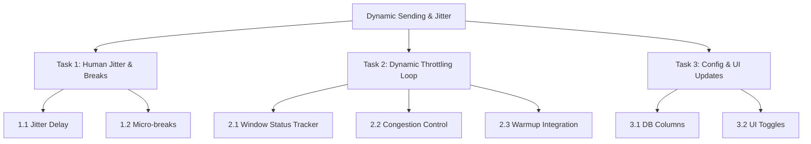

# BillionMail Dynamic Sending & Jitter Implementation Plan

This document outlines the tasks and subtasks required to implement human-like sending jitter, micro-breaks, and dynamic rate scaling based on delivery feedback loops in BillionMail. 

---

## 📋 GOAL
Prevent spam filter triggers, blacklisting, and rate-limiting from major providers (Microsoft, Google) by:
1. **Mimicking human behavior:** Introducing randomized delays (jitter) and scheduled sending pauses (micro-breaks).
2. **Adaptive throttling:** Automatically scaling down threads and speed limits when the receiving servers start returning temporary deferrals (e.g., `451 Server busy`), and scaling back up when delivery is smooth.

---

## 🛠️ ARCHITECTURAL CONTEXT
* **Current Threads:** Auto-threads defaults to 6 parallel workers (`ants.NewPool(6)`) with a cap of 1,000 emails/minute. Manual threads ($N$) uses $N$ workers capped at $N$ emails/minute.
* **Current Limiting:** Handled per IP/Provider group by the Redis Token Bucket rate limiter in `core/internal/service/warmup/rate_limiter.go`.
* **Current Sending Loop:** Executed in batches in `core/internal/service/batch_mail/task_executor.go`.

---

## 📂 TASK & SUBTASK BREAKDOWN



### 1. Task 1: Human-like Jitter & Micro-Breaks
**Objective:** Break mathematical sending patterns that trigger anti-spam detection.

*   [ ] **Subtask 1.1: Randomized Sending Jitter**
    *   *Files to modify:* `core/internal/service/batch_mail/task_executor.go`
    *   *Implementation:* In the sending loop, instead of using a fixed sleep duration between emails, inject randomized sleep intervals.
    *   *Logic:*
        ```go
        // If target interval is 5 seconds, add/subtract random variation (e.g. 20% to 50%)
        jitterFactor := grand.Float64Range(0.7, 1.4)
        actualSleep := time.Duration(float64(baseSleep) * jitterFactor)
        time.Sleep(actualSleep)
        ```
*   [ ] **Subtask 1.2: Micro-Breaks**
    *   *Files to modify:* `core/internal/service/batch_mail/task_executor.go`
    *   *Implementation:* Track the number of emails sent in the current session. After $C$ emails (e.g., random chunk size between 40 and 80), pause execution.
    *   *Logic:* Sleep for a random interval (e.g., 2 to 5 minutes) to simulate a human sender taking a break before resuming the queue.

---

### 2. Task 2: Dynamic Throttling Feedback Loop (Congestion Control)
**Objective:** React dynamically to server deferrals (like Microsoft `451 Server busy`) before they escalate to hard blocks.

*   [ ] **Subtask 2.1: Sliding Window Delivery Tracker**
    *   *Files to modify:* `core/internal/service/batch_mail/task_executor.go`
    *   *Implementation:* Maintain an in-memory sliding window or Redis-based ring buffer of the last $W$ attempts (e.g., 50 attempts) per sending IP and target domain.
    *   *Data to track:* Timestamp, IP, Destination Domain, Status (`sent` or `deferred`).
*   [ ] **Subtask 2.2: Congestion Control Algorithm (AIMD)**
    *   *Files to modify:* `core/internal/service/batch_mail/task_executor.go`
    *   *Implementation:* Apply Additive Increase/Multiplicative Decrease (AIMD) algorithm based on window status:
        *   **If Deferral Rate > 10%:** Immediately halve the sending rate limit (`maxPerMinute`) and reduce the active thread pool size for that task to prevent overwhelming the target.
        *   **If Deferral Rate is 0%:** Additively increase the sending rate (e.g., $+2$ emails per minute) up to the configuration ceiling.
*   [ ] **Subtask 2.3: Warmup Limiter Integration**
    *   *Files to modify:* `core/internal/service/warmup/rate_limiter.go`
    *   *Implementation:* Ensure that the dynamic rate scaling never exceeds the maximum allowable limits defined by the IP's current warmup day. The warmup day limit acts as a hard ceiling.

---

### 3. Task 3: Configuration & UI Integration
**Objective:** Allow users to toggle and customize these settings from the campaign interface.

*   [ ] **Subtask 3.1: Database Schema Expansion**
    *   *Files to modify:* `core/internal/service/database_initialization/batch_mail.go`
    *   *Action:* Add columns to `email_tasks`:
        *   `enable_jitter` (smallint, default 1)
        *   `enable_breaks` (smallint, default 1)
        *   `enable_dynamic_rate` (smallint, default 1)
*   [ ] **Subtask 3.2: Campaign Create/Edit UI**
    *   *Files to modify:* `core/frontend/src/views/market/task/edit.vue`
    *   *Action:* Add toggles under the Advanced/Warmup section to turn Jitter, Micro-breaks, and Dynamic Rate control ON/OFF.

---

## 🧪 TESTING & VERIFICATION

1.  **Jitter Verification:**
    *   Send a campaign and review `mailstat_send_mails` timestamps.
    *   Assert that the interval between consecutive sends from the same sender has a randomized variance rather than a constant gap.
2.  **Throttling Verification:**
    *   Configure a mock mail server to return `451 Server busy` for 50% of requests.
    *   Verify that the `TaskExecutor` dynamically scales down the active thread pool size and increases delays on-the-fly.
